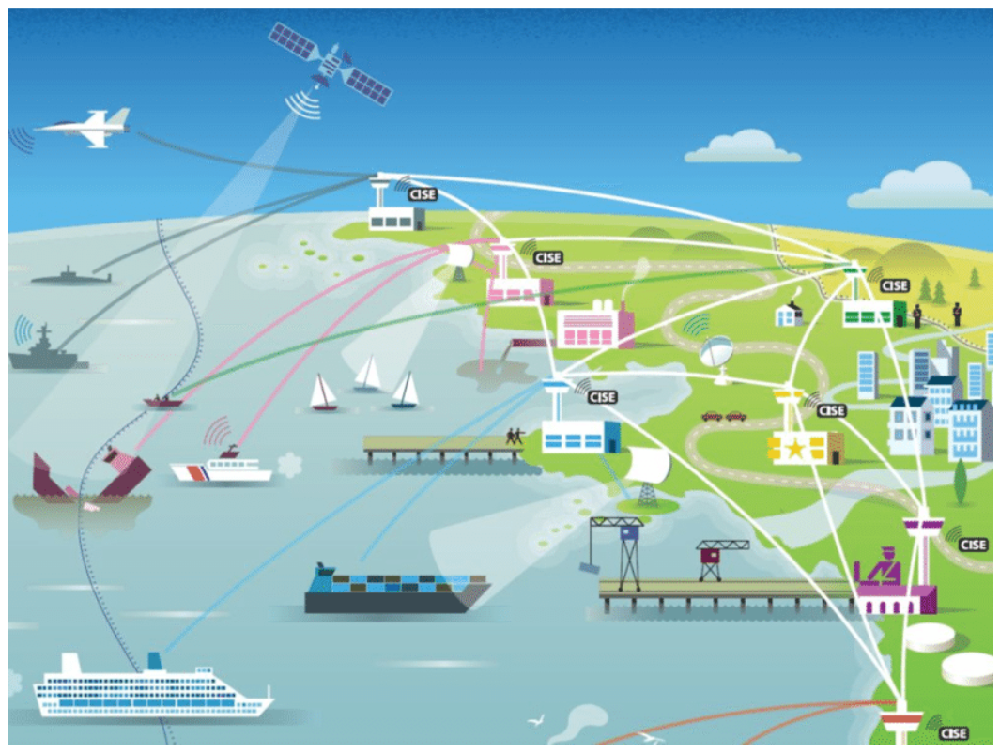
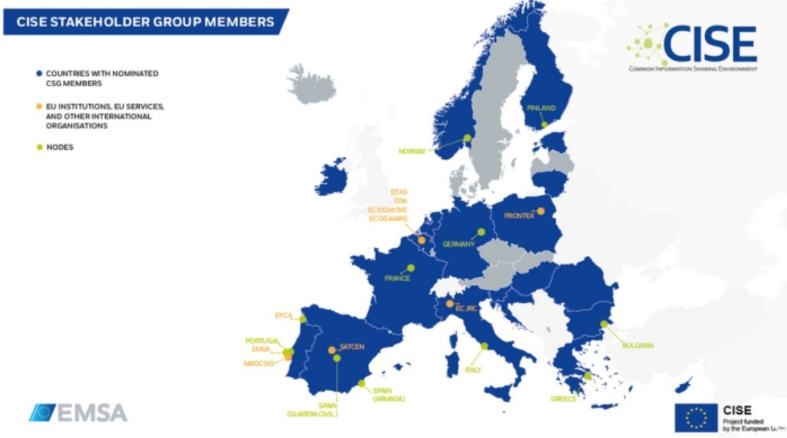
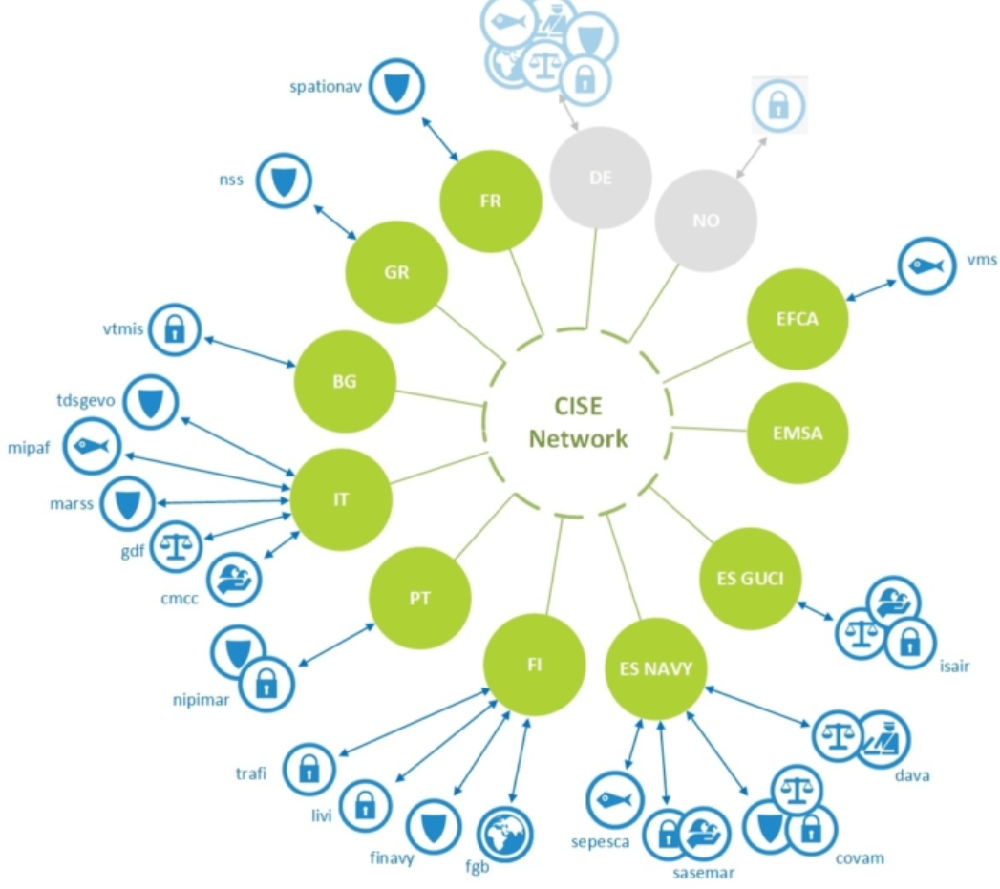

> The common information sharing environment (CISE) is an EU initiative providing a decentralised framework for point-to-point information exchange across sectors and borders. It is involving more than 300 EU and national authorities with responsibilities in maritime surveillance.
>
> CISE aims to make European and national maritime surveillance systems interoperable, enabling all concerned authorities to exchange information in an automatic and secure way.
>
> ref: [>](https://oceans-and-fisheries.ec.europa.eu/ocean/blue-economy/other-sectors/common-information-sharing-environment-cise_en#objectives)

ref: [>](https://www.researchgate.net/figure/Common-information-sharing-environment-CISE-Source-European-Commission-2010_fig3_317859418)

ref: [>](https://www.bssc.pl/2022/09/10/common-information-sharing-environment-cise/)

more information about CISE: [>](https://oceans-and-fisheries.ec.europa.eu/ocean/blue-economy/other-sectors/common-information-sharing-environment-cise_en)

